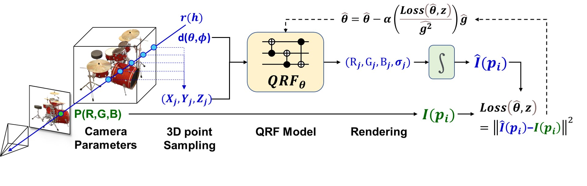

## QRF: Implicit Neural Representations with Quantum Radiance Fields
[Paper](https://arxiv.org/abs/2211.03418) | [Project Page](https://yfyangd.github.io/QRF/) | [Vedio]() | [Code]()

## NeRF vs QRF
* NeRF: given a 3D position (x, y, z), viewing direction (θ, ϕ), NeRF produces static and transient colors (r, g, b) and transparency values (σ).
* QRF: architecture replaces the same task with encoding circuit, parameterized quantum circuits, and quantum activation.

## QRF Architecture
* Quantum Radiance Fields (QRF) with encoding circuits and quantum circuits produces colors (r, g, b) and transparency values (σ) given a 3D position (x, y, z) and viewing direction (θ, ϕ). Similar to the NeRF architecture, QRF enforces that the predicted σ is independent of view direction. Note that this schematic is a simplified quantum circuit with only 4 rotation gates around the z axis.

## Optimization
* We supervise our QRF model by gradient descent using a simple 𝐿2 loss, and use Adam optimizer with a learning rate parameter α=0.001 to keep track of gradient moments over time to redirect the optimization trajectory.

## Comparison
* Volume rendering of Chair, Ship, and Hotdog with training 100k iterations. Compared with NeRF, QRF has faster convergence, higher rendering efficiency, and higher rendering quality under the quantum integration.

 
<iframe frameborder="0" class="juxtapose" width="40%" height="466" src="https://cdn.knightlab.com/libs/juxtapose/latest/embed/index.html?uid=b4696cc8-5dc9-11ed-b5bd-6595d9b17862"></iframe>
 
<iframe frameborder="0" class="juxtapose" width="40%" height="264" src="https://cdn.knightlab.com/libs/juxtapose/latest/embed/index.html?uid=b9f6451c-5dc9-11ed-b5bd-6595d9b17862"></iframe>
<iframe frameborder="0" class="juxtapose" width="40%" height="264" src="https://cdn.knightlab.com/libs/juxtapose/latest/embed/index.html?uid=a2403828-5dc5-11ed-b5bd-6595d9b17862"></iframe>

## Results on real-world captured data
 
<iframe frameborder="0" class="juxtapose" width="40%" height="264" src="https://www.youtube.com/embed/80vbhPJXSCM"></iframe>
<iframe frameborder="0" class="juxtapose" width="40%" height="264" src="https://www.youtube.com/embed/80vbhPJXSCM"></iframe>
<iframe frameborder="0" class="juxtapose" width="40%" height="264" src="https://www.youtube.com/embed/80vbhPJXSCM"></iframe>
<iframe frameborder="0" class="juxtapose" width="40%" height="264" src="https://www.youtube.com/embed/80vbhPJXSCM"></iframe>
<iframe frameborder="0" class="juxtapose" width="40%" height="264" src="https://www.youtube.com/embed/80vbhPJXSCM"></iframe>
<iframe frameborder="0" class="juxtapose" width="40%" height="264" src="https://www.youtube.com/embed/80vbhPJXSCM"></iframe>

## Results on custom casual capturing
* Volume rendering: Pine Tree in front of my home
* Training: 4k iterations
* Camera position from [COLMAP](https://colmap.github.io/)

<iframe allowtransparency="true" width="485" height="402"  src="//scratch.mit.edu/projects/249ca99c5f7f4ed1a3dc119fd7e5938a/embed?autostart=false"  frameborder="0" allowfullscreen></iframe>

