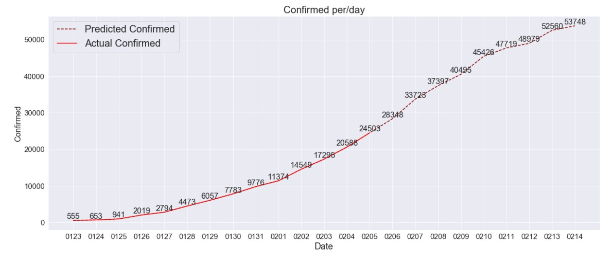

## 2019-nCoV (武漢肺炎) Analysis and Prediction
> **Source of Data:** World Health Organisation (**WHO**), Centers for Disease Control and Prevention (**CDC**)

> **Predict Model:** Seq2Seq (Sequence to Sequence)

> **Training Result:** Validation Score: **0.0194** MSE (**0.1394** RMSE ), **93.75%** ACC

> **Predict:**: The infection forecast for the next three days is **28348**, **33723**, **37397** (2/6,2/7,2/8). The actual number of people infected with the 2019-nCoV in the world will reach **50,000 at 02/13**

<iframe frameborder="0" class="juxtapose" width="40%" height="466" src="https://cdn.knightlab.com/libs/juxtapose/latest/embed/index.html?uid=5f7344a8-5da3-11ed-b5bd-6595d9b17862"></iframe>
<iframe frameborder="0" class="juxtapose" width="40%" height="466" src="https://cdn.knightlab.com/libs/juxtapose/latest/embed/index.html?uid=5f7344a8-5da3-11ed-b5bd-6595d9b17862"></iframe>

### Prediction Result
* The infection forecast for the next three days is **28348**, **33723**, **37397** (2/6,2/7,2/8)
* The actual number of people infected with the 2019-nCoV in the world will reach **50,000 at 02/13*

### Referrence:
* Joseph T Wu, Kathy Leung, Gabriel M Leung, "Nowcasting and forecasting the potential domestic and international spread of the 2019-nCoV outbreak originating in Wuhan, China: a modelling study", Jan, 2020 https://www.thelancet.com/journals/lancet/article/PIIS0140-6736(20)30260-9/fulltext?fbclid=IwAR2Mx2VD5_Q4uep_kXAw3bvhN9lhiMKmuRECW6kUZhBrfRHhU0tykZGrksQ

* Al Kahlout RA, Nasrallah GK, Farag EA, et al., " Comparative serological study for the prevalence of anti-MERS coronavirus antibodies in high-and low-risk groups in Qatar. ", J Immunol Res. 2019; (published online Feb 18. DOI:10.1155/2019/1386740.)

* Zhao S, Ran J, Musa SS, et al., " Preliminary estimation of the basic reproduction number of novel coronavirus (2019-nCoV) in China, from 2019 to 2020: a data-driven analysis in the early phase of the outbreak. ", bioRxiv. 2020; (published online Jan 24. DOI:10.1101/2020.01.23.916395 (preprint).) 
* https://datastudio.google.com/embed/reporting/c84945c0-21a5-42ee-bd79-e6e02dfa43c6/page/eHUDB
* https://kiang.github.io/2019-nCoV/

https://yfyangd.github.io/wuhan.github.io/
