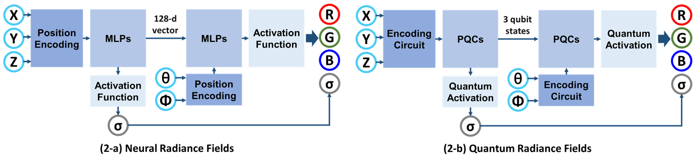
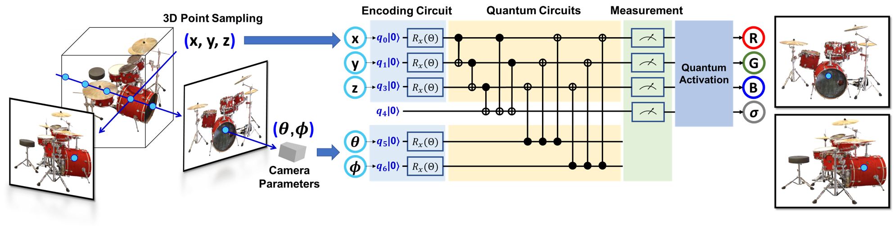
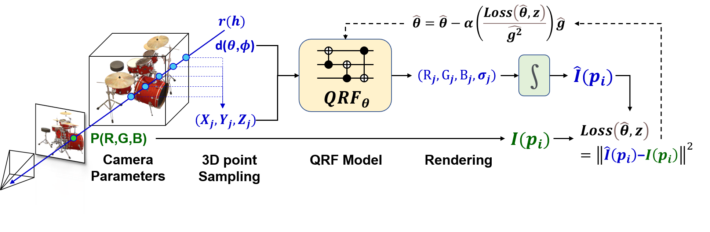
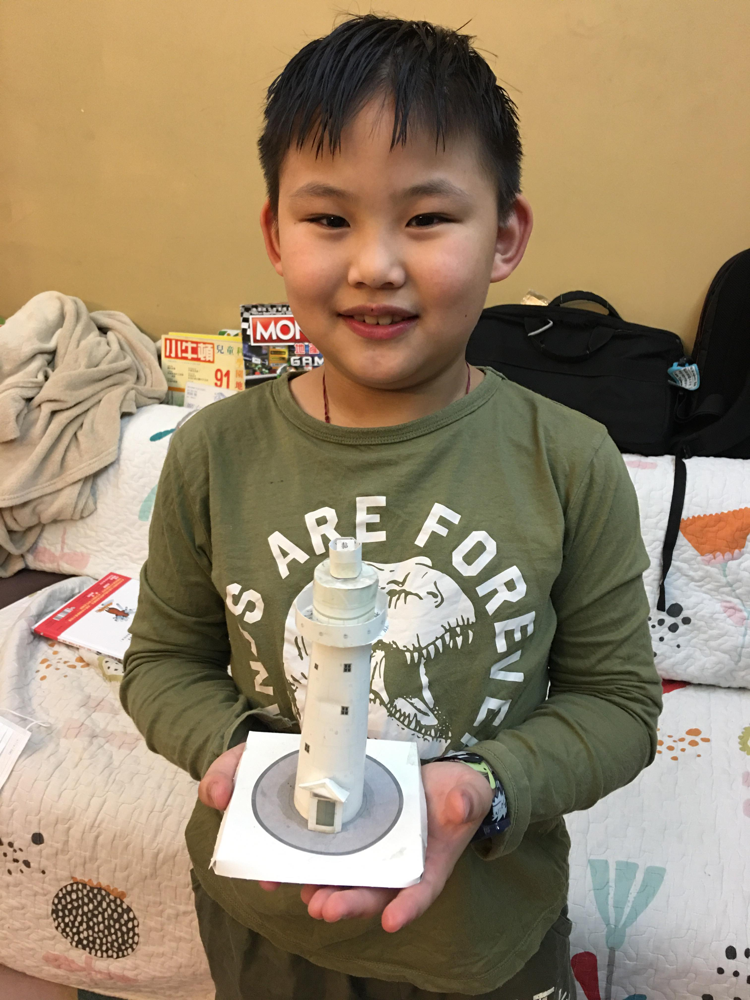

<head>
	<title>Quantum Radiance Fields: A Quantum-Powered Photorealistic Rendering</title>

</head>

## Quantum Radiance Fields: A Quantum-Powered Photorealistic Rendering
[Paper](https://arxiv.org/abs/2211.03418) | [Project Page](https://yfyangd.github.io/QRF/) | [Vedio]() | [Code]()
 
Feel free to use the **chatbot** at the bottom right of the webpage to inquire about any details you'd like to know reqarding this works.

## NeRF vs QRF
* NeRF: given a 3D position (x, y, z), viewing direction (θ, ϕ), NeRF produces static and transient colors (r, g, b) and transparency values (σ).
* QRF: architecture replaces the same task with encoding circuit, parameterized quantum circuits, and quantum activation.

## QRF Architecture
* Quantum Radiance Fields (QRF) with encoding circuits and quantum circuits produces colors (r, g, b) and transparency values (σ) given a 3D position (x, y, z) and viewing direction (θ, ϕ). Similar to the NeRF architecture, QRF enforces that the predicted σ is independent of view direction. Note that this schematic is a simplified quantum circuit with only 4 rotation gates around the z axis.

## Optimization
* We supervise our QRF model by gradient descent using a simple 𝐿2 loss, and use Adam optimizer with a learning rate parameter α=0.001 to keep track of gradient moments over time to redirect the optimization trajectory.

## Comparison
* Volume rendering of Chair, Ship, and Hotdog with training 100k iterations. Compared with NeRF, QRF has faster convergence, higher rendering efficiency, and higher rendering quality under the quantum integration.

<iframe frameborder="0" class="juxtapose" width="40%" height="466" src="https://cdn.knightlab.com/libs/juxtapose/latest/embed/index.html?uid=b4696cc8-5dc9-11ed-b5bd-6595d9b17862"></iframe>
<iframe frameborder="0" class="juxtapose" width="60%" height="330" src="https://cdn.knightlab.com/libs/juxtapose/latest/embed/index.html?uid=b9f6451c-5dc9-11ed-b5bd-6595d9b17862"></iframe>
<iframe frameborder="0" class="juxtapose" width="60%" height="330" src="https://cdn.knightlab.com/libs/juxtapose/latest/embed/index.html?uid=a2403828-5dc5-11ed-b5bd-6595d9b17862"></iframe>

## Results on real-world captured data
* Camera position from [COLMAP](https://colmap.github.io/)

### Pine Tree in front of my home
* Training: 4k iterations
* The left one is inferenced by NeRF. The right one is inferenced by QRF.

 

### Succulent Plan Potted
* Training: 4k iterations with 16 samples.
 

 
 
 
 
 
 
 
 
 
 
 
 
 
 
 

* 3D mesh result with 64 samples.
 

 <iframe title="Succulent_Plan_Potted" frameborder="0" allowfullscreen mozallowfullscreen="true" webkitallowfullscreen="true" allow="autoplay; fullscreen; xr-spatial-tracking" xr-spatial-tracking execution-while-out-of-viewport execution-while-not-rendered web-share width="640" height="480" src="https://sketchfab.com/models/ea0fe389e1694d4a9f797700184ba3ed/embed"> </iframe> 
 <a href="https://sketchfab.com/3d-models/succulent-plan-potted-ea0fe389e1694d4a9f797700184ba3ed?utm_medium=embed&utm_campaign=share-popup&utm_content=ea0fe389e1694d4a9f797700184ba3ed" target="_blank" rel="nofollow" style="font-weight: bold; color: #1CAAD9;"> Succulent_Plan_Potted </a> by <a href="https://sketchfab.com/yfyangd?utm_medium=embed&utm_campaign=share-popup&utm_content=ea0fe389e1694d4a9f797700184ba3ed" target="_blank" rel="nofollow" style="font-weight: bold; color: #1CAAD9;"> yfyangd </a> on <a href="https://sketchfab.com?utm_medium=embed&utm_campaign=share-popup&utm_content=ea0fe389e1694d4a9f797700184ba3ed" target="_blank" rel="nofollow" style="font-weight: bold; color: #1CAAD9;">Sketchfab</a>

### Bench Park
* Training: 120k iterations with 64 samples.
 
<iframe width="560" height="315" src="https://www.youtube.com/embed/fJPNj3in8S4" frameborder="0" allow="accelerometer; autoplay; clipboard-write; encrypted-media; gyroscope; picture-in-picture" allowfullscreen></iframe>
 
* 3D mesh result with 64 samples.
 

 <iframe title="Bench at Park" frameborder="0" allowfullscreen mozallowfullscreen="true" webkitallowfullscreen="true" allow="autoplay; fullscreen; xr-spatial-tracking" xr-spatial-tracking execution-while-out-of-viewport execution-while-not-rendered web-share width="640" height="480" src="https://sketchfab.com/models/e5f82af824bd4541ad1ab612b9da7b12/embed"> </iframe> 
 <a href="https://sketchfab.com/3d-models/bench-at-park-e5f82af824bd4541ad1ab612b9da7b12?utm_medium=embed&utm_campaign=share-popup&utm_content=e5f82af824bd4541ad1ab612b9da7b12" target="_blank" rel="nofollow" style="font-weight: bold; color: #1CAAD9;"> Bench at Park </a> by <a href="https://sketchfab.com/yfyangd?utm_medium=embed&utm_campaign=share-popup&utm_content=e5f82af824bd4541ad1ab612b9da7b12" target="_blank" rel="nofollow" style="font-weight: bold; color: #1CAAD9;"> yfyangd </a> on <a href="https://sketchfab.com?utm_medium=embed&utm_campaign=share-popup&utm_content=e5f82af824bd4541ad1ab612b9da7b12" target="_blank" rel="nofollow" style="font-weight: bold; color: #1CAAD9;">Sketchfab</a>

### Eluanbi Lighthouse

 

 <iframe title="Eluanbi Lighthouse Model" frameborder="0" allowfullscreen mozallowfullscreen="true" webkitallowfullscreen="true" allow="autoplay; fullscreen; xr-spatial-tracking" xr-spatial-tracking execution-while-out-of-viewport execution-while-not-rendered web-share width="640" height="480" src="https://sketchfab.com/models/ee6b562cd45a4edd80741ca678cd2581/embed"> </iframe> 
 <a href="https://sketchfab.com/3d-models/eluanbi-lighthouse-model-ee6b562cd45a4edd80741ca678cd2581?utm_medium=embed&utm_campaign=share-popup&utm_content=ee6b562cd45a4edd80741ca678cd2581" target="_blank" rel="nofollow" style="font-weight: bold; color: #1CAAD9;"> Eluanbi Lighthouse Model </a> by <a href="https://sketchfab.com/yfyangd?utm_medium=embed&utm_campaign=share-popup&utm_content=ee6b562cd45a4edd80741ca678cd2581" target="_blank" rel="nofollow" style="font-weight: bold; color: #1CAAD9;"> yfyangd </a> on <a href="https://sketchfab.com?utm_medium=embed&utm_campaign=share-popup&utm_content=ee6b562cd45a4edd80741ca678cd2581" target="_blank" rel="nofollow" style="font-weight: bold; color: #1CAAD9;">Sketchfab</a>

